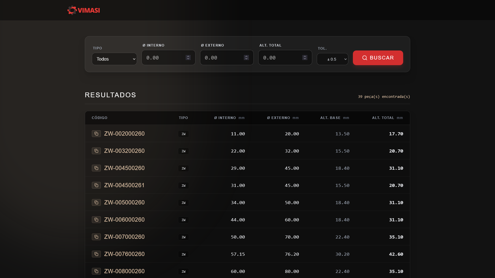

# Vimasi Painel - Busca de Estoque (MVP)

An ultra-fast search engine for wiper seals and all other parts from the PDF catalog, allowing precise filtering by internal size, external size, and height. Designed specifically for **Vimasi**.

A aplicação não necessita de banco de dados externo ou backend, tornando-a incrivelmente veloz, com dados sendo carregados diretamente de uma base estática embarcada.

**🔗 Acessar o sistema:** [https://painel.vimasi-vedacoes.com/](https://painel.vimasi-vedacoes.com/)



## 🚀 Funcionalidades Principais

* **Busca Dimensional Inteligente**: Filtre as peças cruzando diâmetro interno (Ø), diâmetro externo (Ø) e altura.
* **Tolerância Dinâmica**: Permite estipular margens de erro (ex: ± 0.2mm, ± 0.5mm) para localizar peças equivalentes ou substitutas.
* **Mapeamento de Tipos via CSV**: O sistema varre seu banco de dados na inicialização e cria um menu "Tipo" de peças de forma automática (ZW, WS, etc.).
* **Inputs Condicionais**: Selecionar "ZW" faz surgir de forma elegante o campo "Alt. Base" (Altura Base), mantendo a interface limpa até ser necessário.
* **Botão "QUERO" (Cópia Rápida)**: Cada peça encontrada conta com um pequeno botão que copia imediatamente seu código para a área de transferência com confirmação visual (✅ Copiado).
* **UI/UX Premium (Glassmorphism)**: Interface construída usando conceitos modernos, fundos escuros de alto contraste e micro-animações (stagger animations) para não cansar a vista e manter uma apresentação de alto nível técnico.
* **Totalmente Responsivo**: Layout que se adequa do celular à telas de monitores ultrawide num formato "Dashboard".

## 🛠️ Tecnologias Utilizadas

* [**React 18**](https://react.dev/) + [**Vite**](https://vitejs.dev/): Motor de renderização de alta velocidade.
* [**Tailwind CSS (v4)**](https://tailwindcss.com/): Estilização e design system.
* [**PapaParse**](https://www.papaparse.com/): Parse e conversão do banco de dados `data.csv` local direto no navegador.
* [**Lucide React**](https://lucide.dev/): Ícones elegantes e consistentes em padrão SVG.
* [**Bun**](https://bun.sh/): Gerenciador de pacotes e runtime ultra veloz.

## 📦 Como Rodar Localmente

Certifique-se de ter o [Bun](https://bun.sh/) instalado na sua máquina.

1. **Instale as dependências:**
   ```bash
   bun install
   ```
2. **Rode o servidor de desenvolvimento:**
   ```bash
   bun run dev
   ```
3. Abra a porta do localhost gerada (normalmente `http://localhost:5173/`).

## 📁 Banco de Dados (CSV)

O banco de dados é gerido localmente em:
`src/data/data.csv`

Para adicionar novos produtos, basta abrir o `data.csv` no Excel (ou editor de texto) e incluir novas linhas respeitando os cabeçalhos:
`Codigo,Tipo,Externo,Interno,AlturaBase,AlturaTotal`

## ☁️ Como Fazer o Deploy (GitHub Pages)

O projeto já está 100% configurado para ser hospedado **de graça** via GitHub Pages.

1. Mande os arquivos para um repositório no seu GitHub.
2. No seu repositório, vá em **Settings** > **Pages** (no menu da esquerda).
3. Na seção "Build and deployment", altere o "Source" para **GitHub Actions**.
4. É só aguardar cerca de 1 minuto. O GitHub Actions executará as instruções que deixamos prontas na pasta `.github/workflows/deploy.yml` e colocará o sistema no ar de forma automática!
