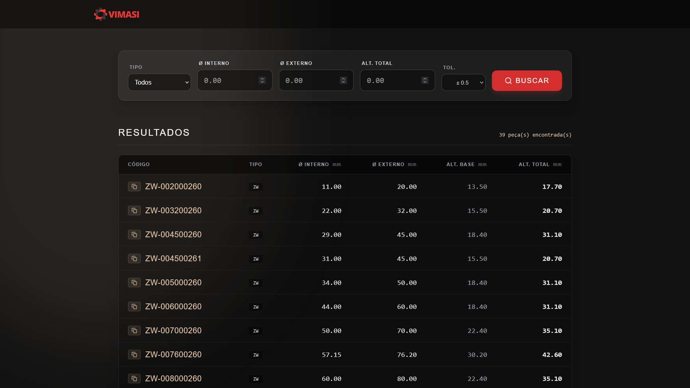

# Vimasi Painel - Busca de Estoque
An ultra-fast search engine for wiper seals, O-rings, Chevron gaskets, and all 20 categories from the PDF catalog (over 6,000 parts). Allows precise filtering by dimensions like internal/external sizes, height, diameter, and thickness depending on the part type. Designed specifically for **Vimasi**.

A aplicação não necessita de banco de dados externo ou backend, tornando-a incrivelmente veloz, com dados sendo carregados dinamicamente de arquivos CSV estáticos embarcados.

**🔗 Acessar o sistema:** [https://painel.vimasi-vedacoes.com/](https://painel.vimasi-vedacoes.com/)



## 🚀 Funcionalidades Principais

* **Busca Dimensional Inteligente e Global**: Filtre as peças cruzando dimensões. Busque em todas as 20 categorias simultaneamente ou filtre por uma específica.
* **Tolerância Dinâmica**: Permite estipular margens de erro (ex: ± 0.2mm, ± 0.5mm) para localizar peças equivalentes ou substitutas.
* **Formulário Dinâmico**: O formulário se adapta à categoria selecionada (ex: O-Ring mostra "Diâmetro" e "Espessura", ZW mostra "Alt. Base", Fita Guia mostra "Comprimento").
* **Tabela Adaptativa**: As colunas da tabela de resultados ajustam-se para exibir apenas as dimensões pertinentes aos tipos sendo visualizados.
* **Botão "QUERO" (Cópia Rápida)**: Cada peça encontrada conta com um pequeno botão que copia imediatamente seu código para a área de transferência com confirmação visual (✅ Copiado).
* **UI/UX Premium (Glassmorphism)**: Interface construída usando conceitos modernos, fundos escuros de alto contraste e micro-animações (stagger animations) para não cansar a vista e manter uma apresentação de alto nível técnico.
* **Totalmente Responsivo**: Layout que se adequa do celular à telas de monitores ultrawide num formato "Dashboard".

## 🛠️ Tecnologias Utilizadas

* [**React 18**](https://react.dev/) + [**Vite**](https://vitejs.dev/): Motor de renderização de alta velocidade.
* [**Tailwind CSS (v4)**](https://tailwindcss.com/): Estilização e design system.
* [**PapaParse**](https://www.papaparse.com/): Parse e conversão do banco de dados `data.csv` local direto no navegador.
* [**Lucide React**](https://lucide.dev/): Ícones elegantes e consistentes em padrão SVG.
* [**Bun**](https://bun.sh/): Gerenciador de pacotes e runtime ultra veloz.

## 📦 Como Rodar Localmente

Certifique-se de ter o [Bun](https://bun.sh/) instalado na sua máquina.

1. **Instale as dependências:**
   ```bash
   bun install
   ```
2. **Rode o servidor de desenvolvimento:**
   ```bash
   bun run dev
   ```
3. Abra a porta do localhost gerada (normalmente `http://localhost:5173/`).

## 📁 Banco de Dados (CSV)

O banco de dados é gerido localmente em múltiplos arquivos CSV na pasta:
`src/data/data_*.csv`

O sistema suporta 20 categorias de peças, cada uma em seu próprio arquivo (ex: `data_oring_de_pu.csv`, `data_conjunto_zw.csv`).

Para adicionar novos produtos, basta abrir o CSV da categoria correspondente no Excel (ou editor de texto) e incluir novas linhas respeitando os cabeçalhos. O arquivo de configuração central encontra-se em `src/config/categories.js`.

## ☁️ Como Fazer o Deploy (GitHub Pages)

O projeto já está 100% configurado para ser hospedado **de graça** via GitHub Pages.

1. Mande os arquivos para um repositório no seu GitHub.
2. No seu repositório, vá em **Settings** > **Pages** (no menu da esquerda).
3. Na seção "Build and deployment", altere o "Source" para **GitHub Actions**.
4. É só aguardar cerca de 1 minuto. O GitHub Actions executará as instruções que deixamos prontas na pasta `.github/workflows/deploy.yml` e colocará o sistema no ar de forma automática!
